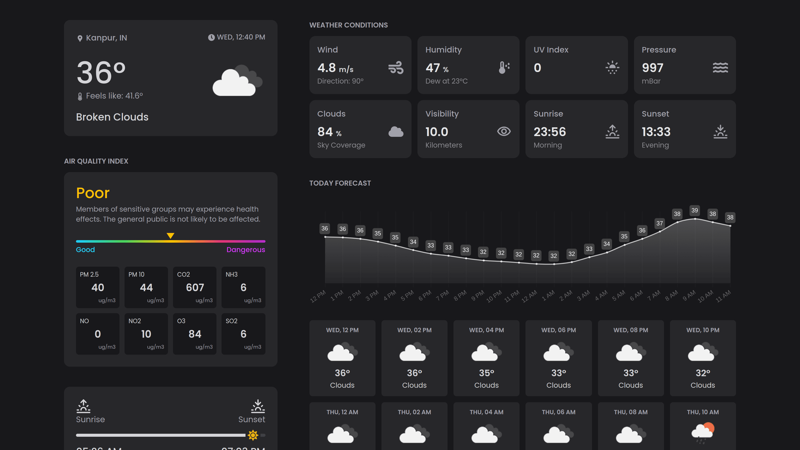

 It's an advanced weather website where users can view current weather conditions, forecasts, air quality, weather maps, and more. The application is built using modern web development technologies to ensure a seamless and responsive user experience.

## Features

- **Current Weather**: View the current weather conditions for any location.
- **Weather Forecasts**: Access detailed weather forecasts for the upcoming days.
- **Air Quality**: Check the air quality index and related information.
- **Weather Maps**: Explore interactive weather maps for visualizing different weather parameters.
- **Responsive Design**: Fully responsive design to provide a great experience on both desktop and mobile devices.

## Technologies Used

- **Next.js**: A React framework for server-side rendering and generating static websites.
- **TypeScript**: A typed superset of JavaScript that adds type safety and enhances development experience.
- **Tailwind CSS**: A utility-first CSS framework for styling the application.
- **Axios**: A promise-based HTTP client for making requests to the OpenWeather API.
- **OpenWeather API**: Used to fetch weather data, forecasts, and air quality information.

## Screenshot



## Getting Started

Follow these instructions to set up the project on your local machine.

### Prerequisites

Ensure you have the following installed:

- Node.js (>= 14.x)
- npm or yarn

### Installation

1. **Clone the repository**:

    ```bash
    git clone https://github.com/devxprite/star-weather.git
    cd star-weather
    ```

2. **Install dependencies**:

    ```bash
    npm install
    ```

3. **Set up environment variables**:

    Create a `.env.local` file in the root directory and add your OpenWeather API key:

    ```bash
    OPENWEATHER_API_KEY=your_openweather_api_key
    ```

4. **Run the development server**:

    ```bash
    npm run dev
    ```

    Open [http://localhost:3000](http://localhost:3000) with your browser to see the application in action.


### Contributing
Contributions are welcome! Feel free to open an issue or submit a pull request if you have any improvements to the project.

### License
Distributed under the MIT License. See `LICENSE` for more information.

### Acknowledgements

- [OpenWeather](https://openweathermap.org/)
- [Next.js](https://nextjs.org/)
- [Tailwind CSS](https://tailwindcss.com/)
- [Axios](https://axios-http.com/)
- [Windy](https://www.windy.com/)

### Support
Give a ⭐️ if you found this project helpful!